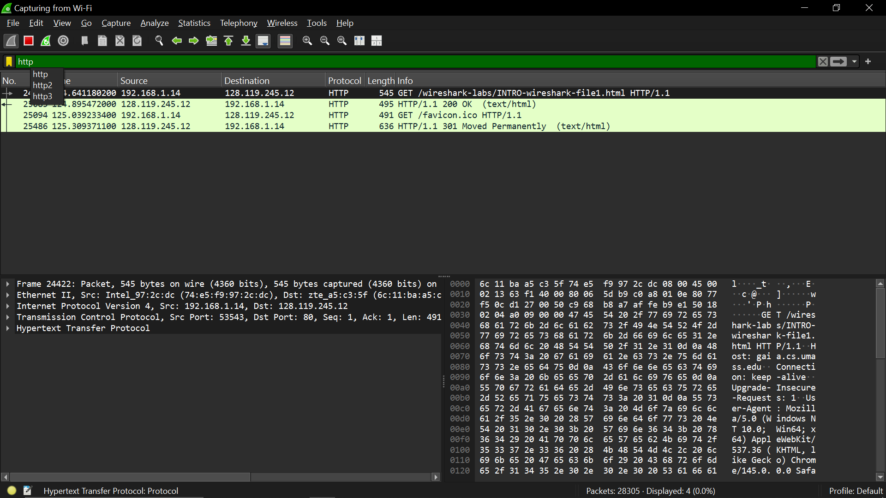

# laporan praktikum jarkom

## tujuan praktikum
mempelajari paket request dan paket response

## langkah percobaan
1. Jalankan link: http://gaia.cs.umass.edu/wireshark-labs/INTRO-wireshark-file1.html di chrome
2. Filter: http

## lampiran
hasil percobaan:
