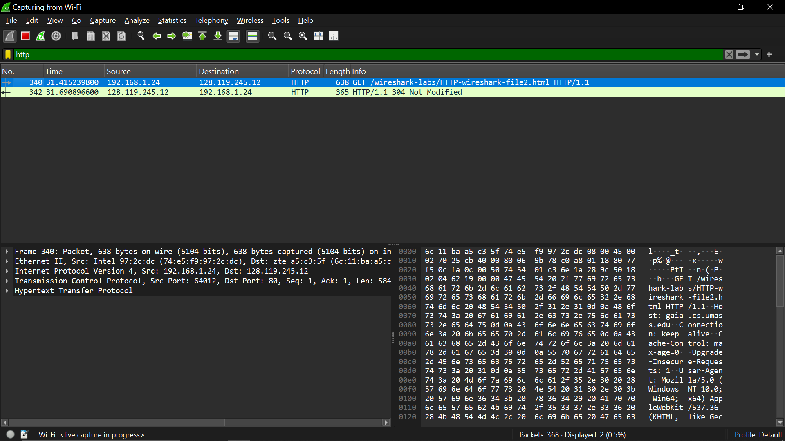
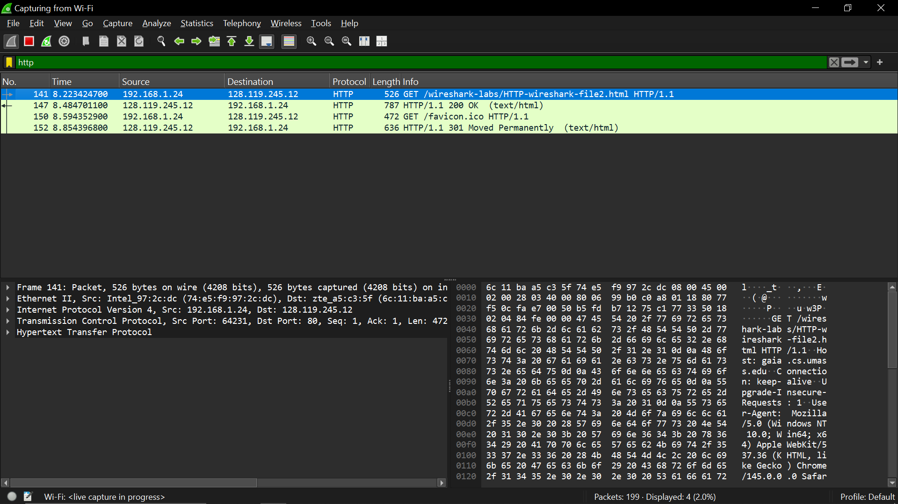

# laporan praktikum jarkom

## tujuan praktikum
mempelajari status 301 dan 304

## langkah percobaan
1. Jalankan link: http://gaia.cs.umass.edu/wireshark-labs/HTTP-wireshark-file2.html di chrome
2. Filter: http

## lampiran
hasil percobaan:

setelah menghapus cache
