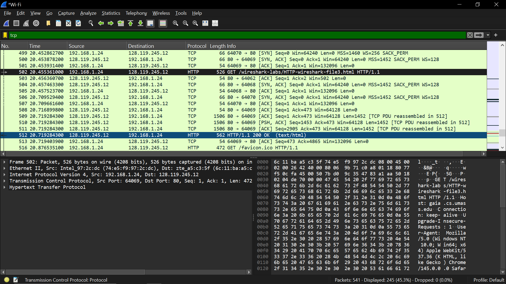

# laporan praktikum jarkom

## tujuan praktikum
mempelajari transfer data yang dipecah menjadi segmen kecil

## langkah percobaan
1. Jalankan link: http://gaia.cs.umass.edu/wireshark-labs/HTTP-wireshark-file3.html di chrome
2. Filter: http

## lampiran
hasil percobaan:

dipecah menjadi tiga bagian (509, 510, dan 511)