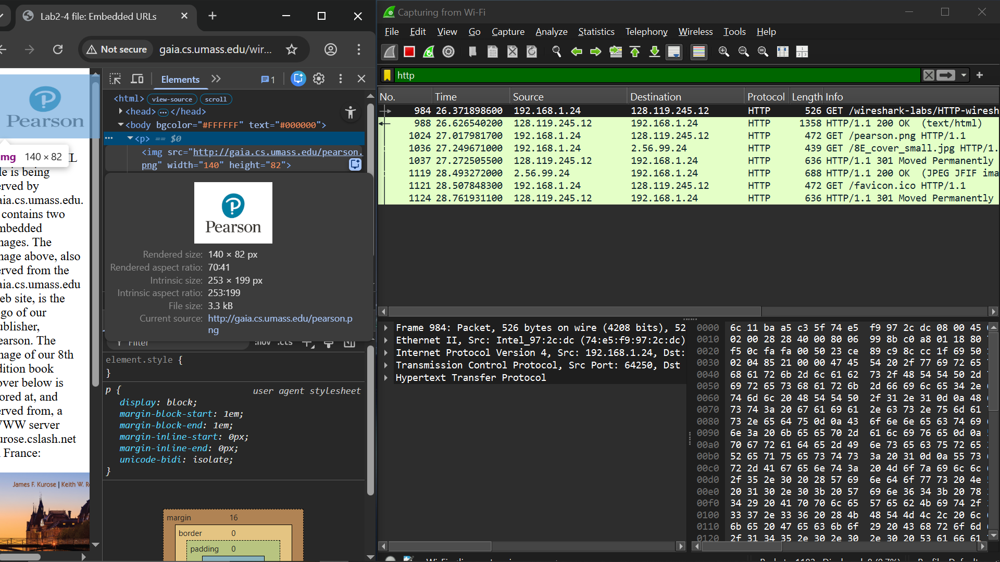
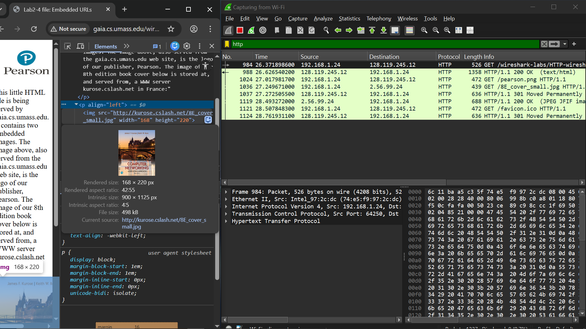
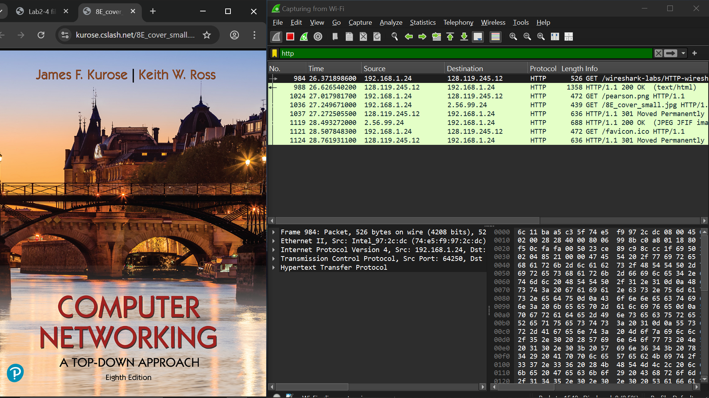

# laporan praktikum jarkom

## tujuan praktikum
mempelajari png dan jpg dalam html

## langkah percobaan
1. Jalankan link: http://gaia.cs.umass.edu/wireshark-labs/HTTP-wireshark-file4.html di chrome
2. Filter: http

## lampiran
hasil percobaan:

gambar tidak dibuat lokal dalam html (terpisah)
