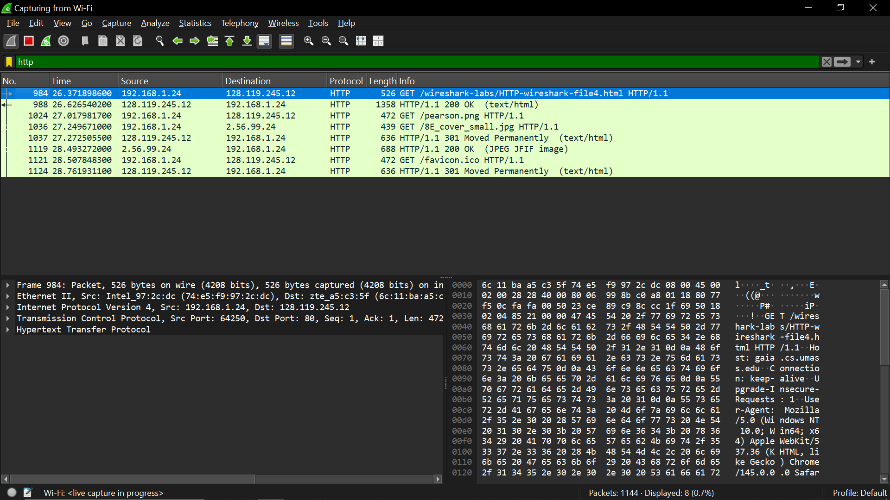

# laporan praktikum jarkom

## tujuan praktikum
mempelajari kekurangan http di bagian keamanan

## langkah percobaan
1. Jalankan link: http://gaia.cs.umass.edu/wireshark-labs/HTTP-wireshark-file5.html di chrome
2. Filter: http

## lampiran
hasil percobaan:

username dan password tidak di-enkripsi, sehingga mudah terbaca (tidak aman)
