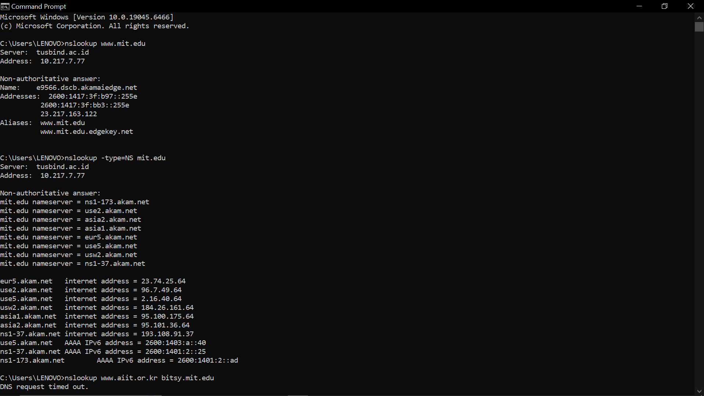
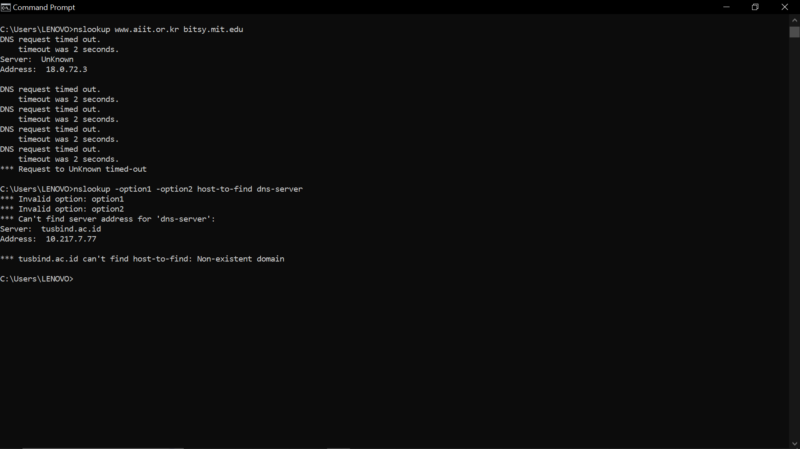
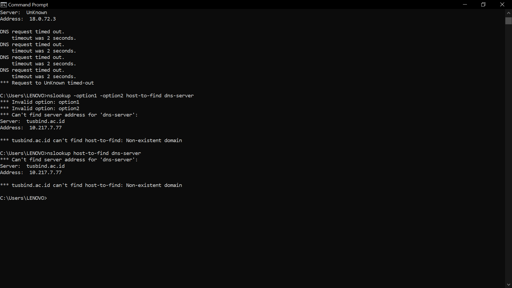

nslookup: memungkinkan host yang menjalankan perintah untuk bertanya mengenai suatu server DNS dan mendapatkan informasi DNS dari server tersebut
langkah-langkah:
1. Buka terminal
2. Command Prompt
3. Query domain (record A). Ketik: nslookup www.mit.edu

4. Query DNS otoritatif (record NS) Ketik: nslookup -type=NS mit.edu

