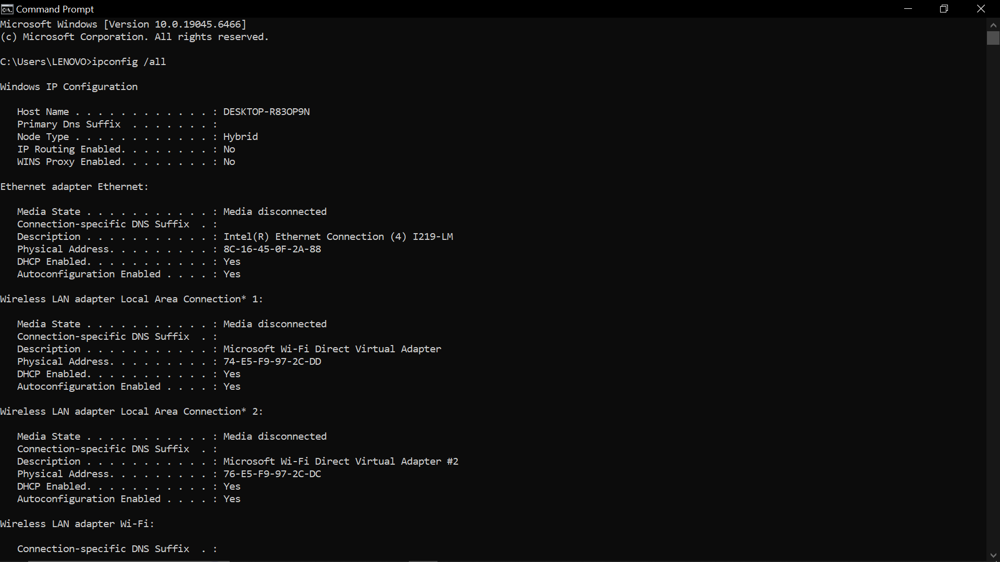
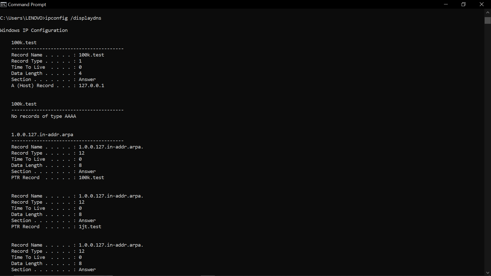
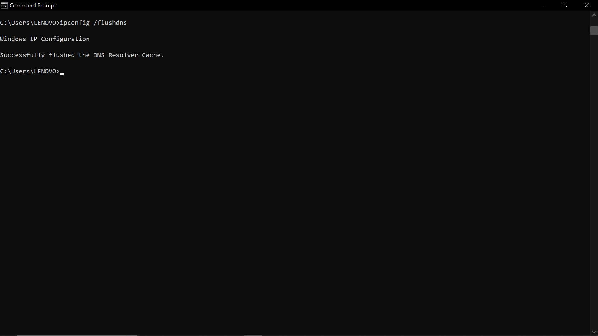

ipconfig: menampilkan informasi mengenai TCP/IP saat ini
1. Tampilkan konfigurasi lengkap Ketik: ipconfig /all

2. Lihat DNS cache Ketik: ipconfig /displaydns

3. Hapus DNS cache Ketik: ipconfig /flushdns
