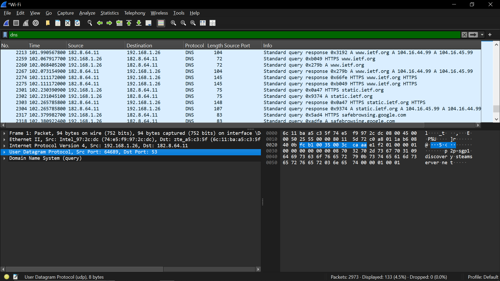
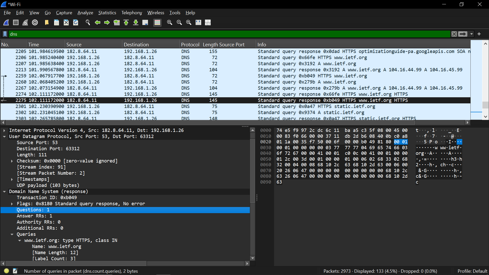
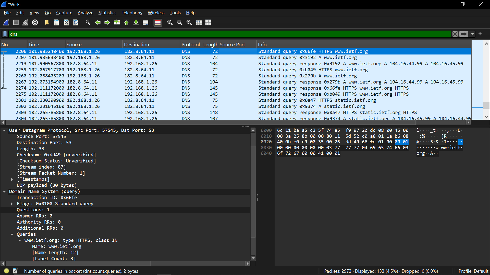
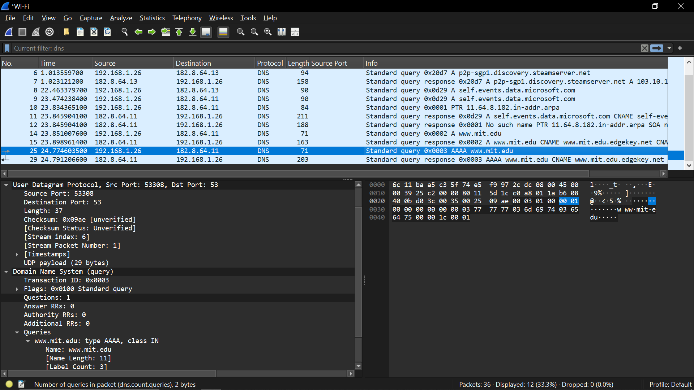
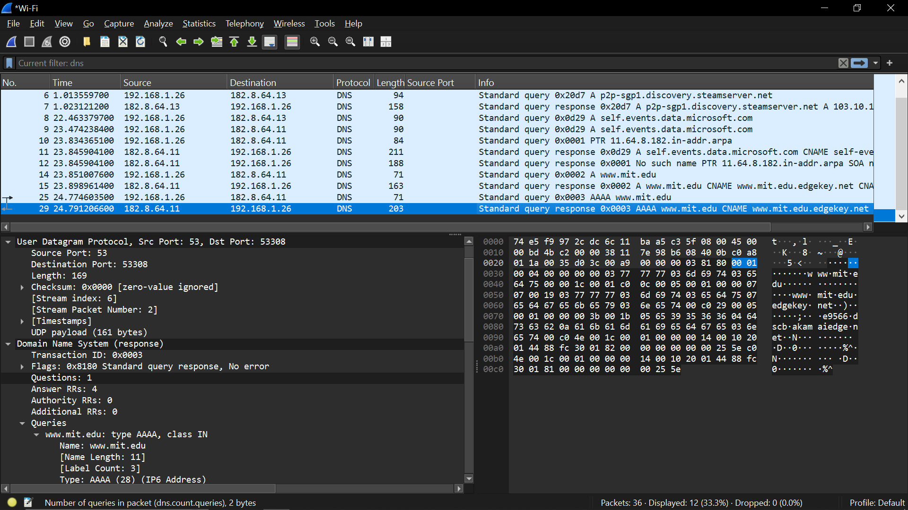
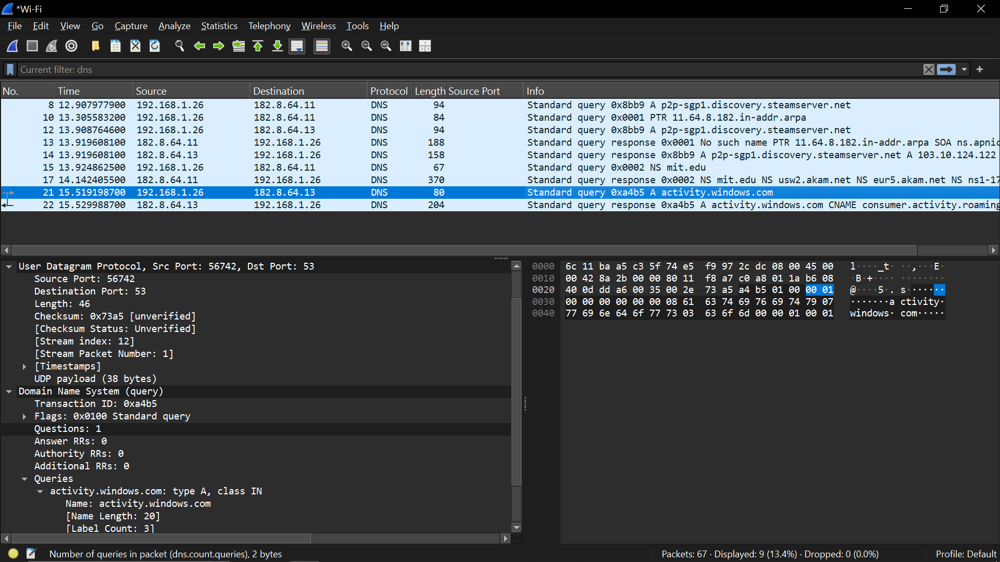
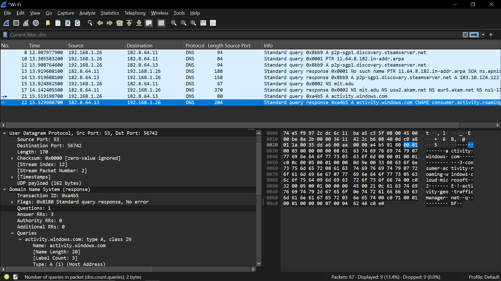
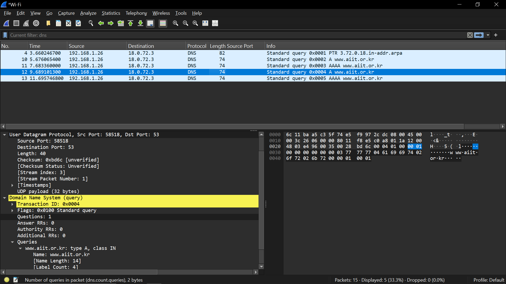
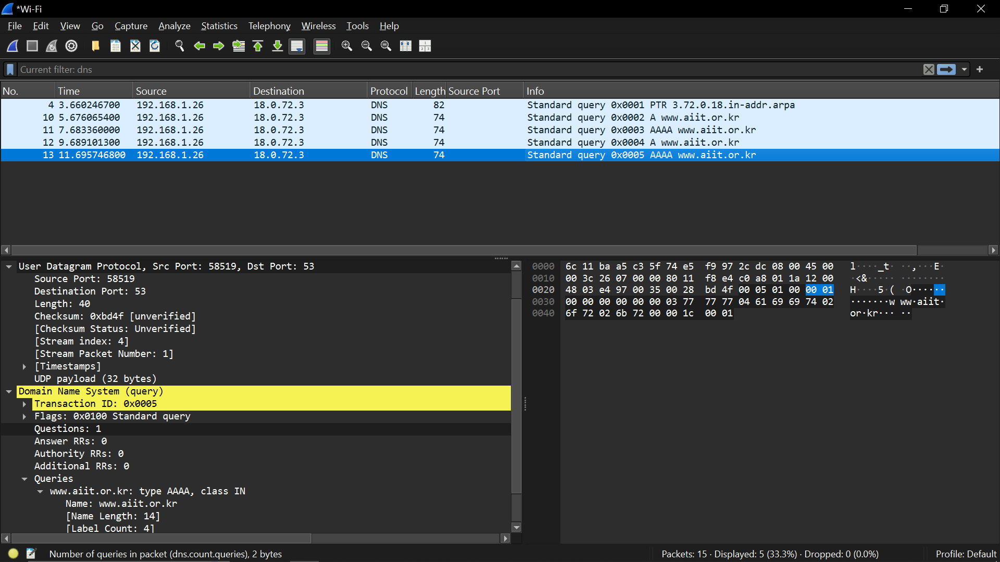

tracing dns
1. Flush DNS. ipconfig /flushdns
2. Buka Wireshark
3. Set filter: ip.addr == (IP)
4. start capture
5. Generate traffic. Buka browser: http://www.ietf.org
6. stop capture
7. Cari paket DNS (filter: dns)

